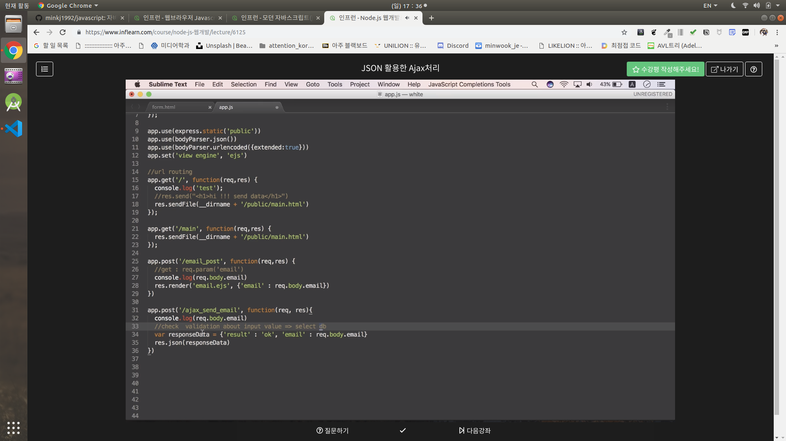
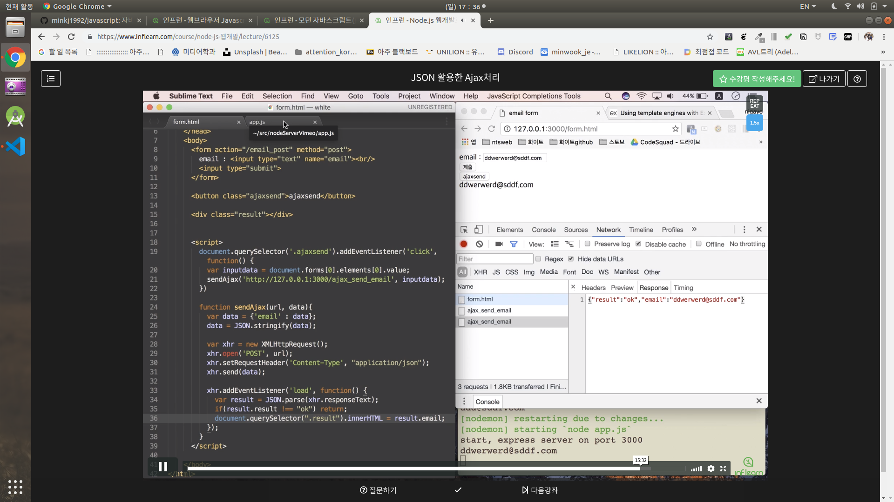

# 섹션 2. Request,Response 처리 기본

## 4강 `[POST 요청처리]`
- `app.post()`
- `body-parser`
    - `npm install body-parser --save`
    - `GET`방식의 `req.param()`을 사용하지 못한다.
    - client로 부터 값을 서버에서 읽어들이기 위해서 `body-parser`를 사용한다.
    - `app.use(bodyParser.json())`
        - `post`방식으로 json 형시의 데이터를 받을 것이다.
    - `app.use(bodyParser.urlencoded({extented:true}))`
    - `req.body.email`
        - body-parser가 서버에서 post return 값을 받아 들이는 방법.
        - body의 `email key value`를 가져온다.

## 5강 `[View engine을 활용한 응답처리]`
- `npm install ejs --save`
- `app.set('View engine', 'ejs)`: `View engine`을 `ejs`로 `set`
- 프로젝트 폴더 생성
    - `프로젝트/views/[원하는파일명].ejs`

- `res.render('[생성한파일명].ejs',{['변수명']: req.body.email})`

## 6강 `[JSON 활용한 Ajax처리]`

- `Ajax`
    - 새로고침 없이, 화면 update
- `app.js`

- `form.js`

